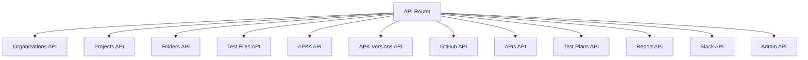

# API Overview

This repository contains several APIs for managing different aspects of the project. Below are links to detailed documentation for each API:

- [Organizations API](organizations_README.md)
- [Projects API](projects_README.md)
- [Folders API](folders_README.md)
- [Test Files API](test_files_README.md)
- [APKs API](apks_README.md)
- [APK Versions API](apk_versions_README.md)
- [GitHub API](github_README.md)
- [APIs API](apis_README.md)
- [Test Plans API](test_plans_README.md)
- [Report API](report_README.md)
- [Slack API](slack_README.md)
- [Admin API](admin_README.md)
