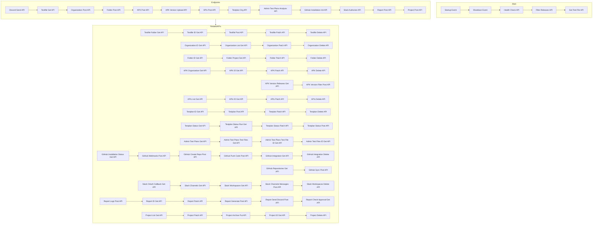

# Project Structure Visualization

This updated diagram includes the related APIs, expanding the structure to show the connections and relationships between various endpoints within the project. Each node represents an API, and the arrows indicate the flow or relationship between them.

[View README2](README2.md)
