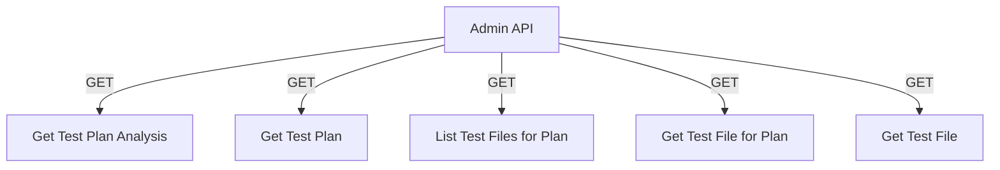

# Admin API

## Endpoints

- **GET** `/api/admin/test-plans/{test_plan_id}/analysis`: Retrieve analysis for a test plan.
- **GET** `/api/admin/test-plans/{test_plan_id}`: Retrieve a specific test plan.
- **GET** `/api/admin/test-plans/{test_plan_id}/test-files`: Retrieve test files for a test plan.
- **GET** `/api/admin/test-plans/{test_plan_id}/test-files/{test_file_id}`: Retrieve a specific test file for a test plan.
- **GET** `/api/admin/test-files/{test_file_id}`: Retrieve a specific test file.
