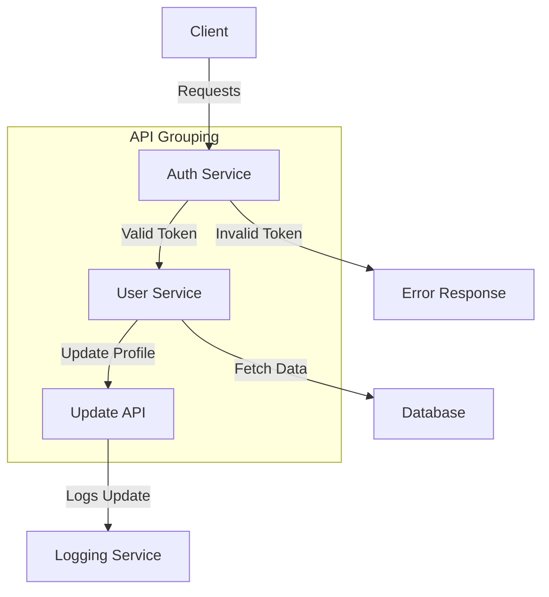

# API Structure and Relationships

## Extracted API Endpoints

### Admin Endpoints
- **Base Path:** `/admin`
- **Methods and Routes:**
  - `GET /admin/apis`: Fetch all APIs for an organization.
  - `GET /admin/apis/{api_id}`: Fetch an API by its ID.
  - `POST /admin/apis`: Create a new API.
  - `PATCH /admin/apis/{api_id}`: Update an existing API.
  - `DELETE /admin/apis/{api_id}`: Delete an API by its ID.

### APK Endpoints
- **Base Path:** `/apk`
- **Methods and Routes:**
  - `POST /apk`: Create a new APK.
  - `GET /apk/organization-apks`: Get all APKs for the organization.
  - `GET /apk/{apk_id}`: Get an APK by ID.
  - `PATCH /apk/{apk_id}`: Update an APK.
  - `DELETE /apk/{apk_id}`: Delete an APK.

### APK Version Endpoints
- **Base Path:** `/apk_version`
- **Methods and Routes:**
  - `POST /{apk_id}/upload`: Upload an APK file for a specific APK ID.
  - `GET /{apk_id}/releases`: Get release details for a specific APK ID.
  - `POST /releases/filter`: Fetch release details for a specific package name and optional display version.

### Folder Endpoints
- **Base Path:** `/folder`
- **Methods and Routes:**
  - `POST /folder`: Create a new folder.
  - `GET /folder/{folder_id}`: Get a folder by ID.
  - `GET /folder/project/{project_id}`: Get all folders in a project.
  - `PATCH /folder/{folder_id}`: Update a folder.
  - `DELETE /folder/{folder_id}`: Delete a folder.

### GitHub Endpoints
- **Base Path:** `/github`
- **Methods and Routes:**
  - `POST /installation/init`: Initialize GitHub installation.
  - `GET /installation/{session_id}/status`: Check GitHub installation status.
  - `POST /webhooks`: Handle GitHub webhooks.

### Organization Endpoints
- **Base Path:** `/organization`
- **Methods and Routes:**
  - `POST /organization`: Create a new organization.
  - `GET /organization/{org_id}`: Get an organization by ID.
  - `GET /organization`: List all organizations.
  - `PATCH /organization/{org_id}`: Update an organization.
  - `DELETE /organization/{org_id}`: Delete an organization.

### Project Endpoints
- **Base Path:** `/project`
- **Methods and Routes:**
  - `POST /project`: Create a new project.
  - `GET /project`: List all projects with filters.
  - `PATCH /project/{project_id}`: Update a project.
  - `PUT /project/{project_id}/archive`: Archive a project.
  - `GET /project/{project_id}`: Get a project by ID.
  - `DELETE /project/{project_id}`: Delete a project.

### Report Endpoints
- **Base Path:** `/report`
- **Methods and Routes:**
  - `POST /report`: Create a new report.
  - `POST /report/{report_id}/logs`: Add new logs to a report.
  - `GET /report/{report_id}`: Get a report by ID.
  - `PATCH /report/{report_id}`: Update a report.
  - `POST /generate-report/{report_id}`: Generate a structured report.
  - `POST /send-discord/{report_id}`: Send a report to Discord.
  - `GET /check-approval/{channel_id}/{message_id}`: Check approval status.

### Slack Endpoints
- **Base Path:** `/slack`
- **Methods and Routes:**
  - Various endpoints for Slack workspace and token management.

## Mermaid.js Diagram

---

This document provides a comprehensive overview of the API structure and relationships within the codebase. The Mermaid.js diagram visualizes the interactions and dependencies between different API endpoints.