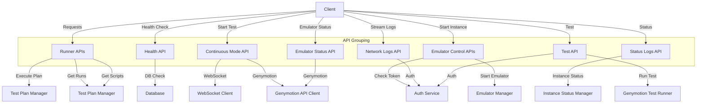

# API Structure and Relationships

## API Endpoints

### Runner APIs
- **POST** `/test-plan/`
- **GET** `/test-plan/{plan_id}/runs`
- **GET** `/test-plan/{run_code}/scripts`

### Health API
- **GET** `/health`

### Continuous Mode API
- **POST** `/start_test`
- **POST** `/submit_instruction/{client_id}`
- **POST** `/stop_test`
- **GET** `/client_sessions`

### Emulator Control APIs
- **POST** `/start_instance/`
- **POST** `/stop_instance/`

### Status Logs API
- **GET** `/status/{instance_name}/{request_uuid}`

### Network Logs API
- **GET** `/stream-logs/{device_id}`

### Emulator Status API
- **GET** `/emulator-status/`
- **GET** `/emulators`

### Test API
- **POST** `/test/`

## API Relationships and Dependencies

- **Runner APIs**: Utilizes `test_plan_manager` and `execute_test_plan`. Handles exceptions like `HTTPException`, `KeyError`.
- **Health API**: Simulated database check.
- **Continuous Mode API**: Interacts with `GenymotionAPIClient` and `WebSocketClient`. Handles HTTP and request exceptions.
- **Emulator Control APIs**: Relies on `check_token`, `start_emulator_pre`, and `release_instance`. Handles instance-related exceptions.
- **Status Logs API**: Uses `InstanceStatusManager` and `auth`. Handles HTTP exceptions.
- **Network Logs API**: Utilizes `auth` and `log_streamer`. Handles token exceptions.
- **Emulator Status API**: Interacts with `GenymotionAPIClient` and `emulator_manager`. Handles HTTP exceptions.
- **Test API**: Utilizes `auth` and `run_genymotion_test`. Handles HTTP exceptions.

## Mermaid.js Diagram

This diagram represents the interactions and dependencies among the various APIs in the codebase.