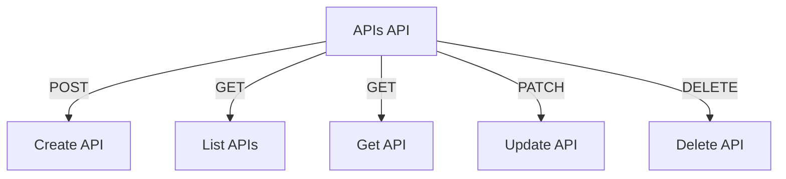

# APIs API

## Endpoints

- **POST** `/api/apis`: Create a new API.
- **GET** `/api/apis`: Retrieve a list of APIs.
- **GET** `/api/apis/{api_id}`: Retrieve a specific API.
- **PATCH** `/api/apis/{api_id}`: Update a specific API.
- **DELETE** `/api/apis/{api_id}`: Delete a specific API.
