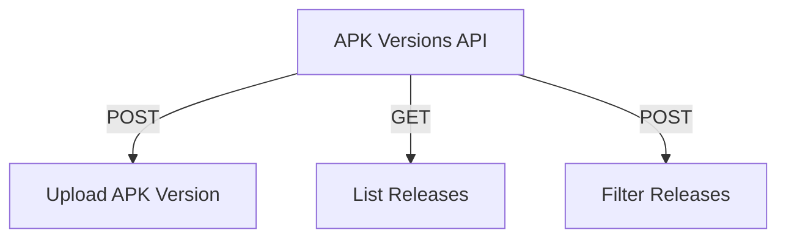

# APK Versions API

## Endpoints

- **POST** `/api/apk-versions/{apk_id}/upload`: Upload a new APK version.
- **GET** `/api/apk-versions/{apk_id}/releases`: Retrieve releases for an APK.
- **POST** `/api/apk-versions/releases/filter`: Filter releases.
