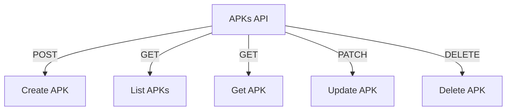

# APKs API

## Endpoints

- **POST** `/api/apks`: Create a new APK.
- **GET** `/api/apks/organization-apks`: Retrieve APKs for an organization.
- **GET** `/api/apks/{apk_id}`: Retrieve a specific APK.
- **PATCH** `/api/apks/{apk_id}`: Update a specific APK.
- **DELETE** `/api/apks/{apk_id}`: Delete a specific APK.
