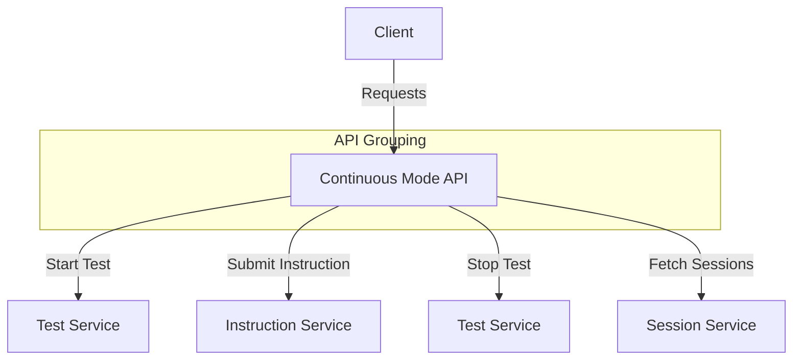

# Continuous Mode API

## GET /client_sessions
- **Description:** Fetch all client sessions.
- **Response:**
  - 200: List of client sessions.

## POST /start_test
- **Description:** Start a new test.
- **Request Body:**
  ```json
  {
    "test_id": "string",
    "parameters": "object"
  }
  ```
- **Response:**
  - 201: Test started successfully.
  - 400: Validation error.

## POST /submit_instruction/{client_id}
- **Description:** Submit an instruction for a specific client.
- **Parameters:**
  - `client_id` (required) - The ID of the client.
- **Request Body:**
  ```json
  {
    "instruction": "string"
  }
  ```
- **Response:**
  - 200: Instruction submitted successfully.
  - 404: Client not found.

## POST /stop_test
- **Description:** Stop a running test.
- **Request Body:**
  ```json
  {
    "test_id": "string"
  }
  ```
- **Response:**
  - 200: Test stopped successfully.
  - 404: Test not found.