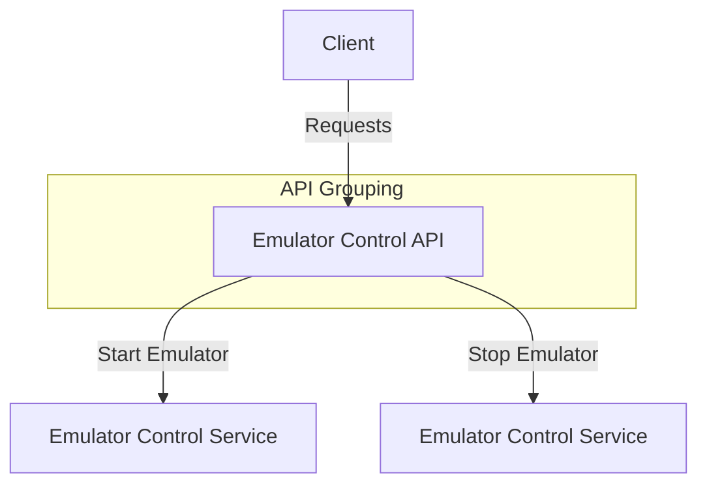

# Emulator Control APIs

## POST /start_instance/
- **Description:** Start an emulator instance.
- **Request Body:**
  ```json
  {
    "instance_name": "string",
    "configuration": "object"
  }
  ```
- **Response:**
  - 201: Instance started successfully.
  - 400: Validation error.

## POST /stop_instance/
- **Description:** Stop an emulator instance.
- **Request Body:**
  ```json
  {
    "instance_name": "string"
  }
  ```
- **Response:**
  - 200: Instance stopped successfully.
  - 404: Instance not found.