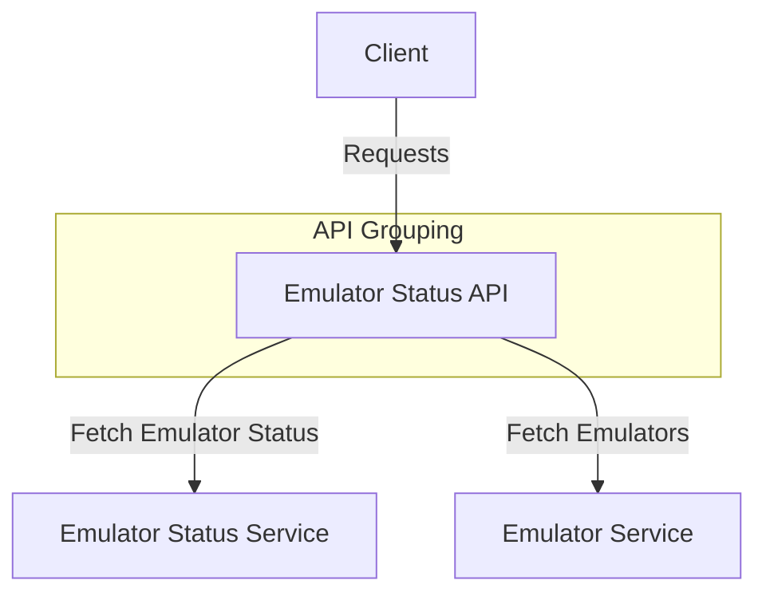

# Emulator Status API

## GET /emulator-status/
- **Description:** Fetch the status of all emulators.
- **Response:**
  - 200: Emulator status list.

## GET /emulators
- **Description:** Fetch a list of emulators.
- **Response:**
  - 200: List of emulators.