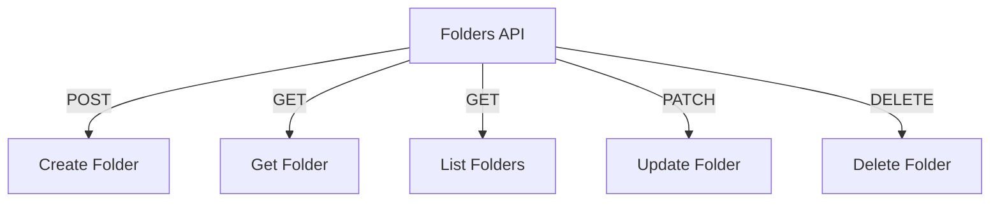

# Folders API

## Endpoints

- **POST** `/api/folders`: Create a new folder.
- **GET** `/api/folders/{folder_id}`: Retrieve a specific folder.
- **GET** `/api/folders/project/{project_id}`: Retrieve folders in a project.
- **PATCH** `/api/folders/{folder_id}`: Update a specific folder.
- **DELETE** `/api/folders/{folder_id}`: Delete a specific folder.
