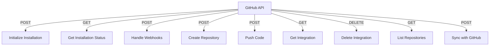

# GitHub API

## Endpoints

- **POST** `/api/github/installation/init`: Initialize GitHub installation.
- **GET** `/api/github/installation/{session_id}/status`: Retrieve installation status.
- **POST** `/api/github/webhooks`: Handle GitHub webhooks.
- **POST** `/api/github/create_repo`: Create a new GitHub repository.
- **POST** `/api/github/push_code`: Push code to GitHub.
- **GET** `/api/github/integration`: Retrieve GitHub integration.
- **DELETE** `/api/github/integration`: Delete GitHub integration.
- **GET** `/api/github/repositories`: Retrieve GitHub repositories.
- **POST** `/api/github/sync`: Sync with GitHub.
