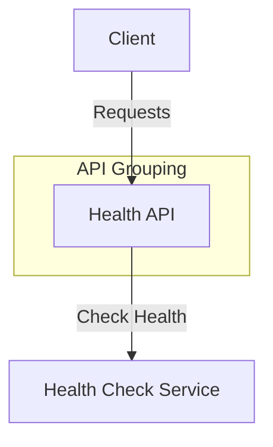

```mermaid
graph TD
    A[Client] -->|Requests| B[Health API]
    B -->|Check Health| C[Health Check Service]
    subgraph API Grouping
        B
    end
```

# Health API

## GET /health
- **Description:** Check the health status of the service.
- **Response:**
  - 200: Service is healthy.
  - 503: Service is unavailable.