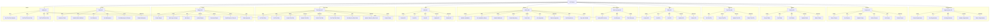

# API Structure Visualization

This document visualizes the structure of the APIs and their connections using Mermaid.js.

```mermaid
graph TD;
    api_router[API Router] --> organizations[Organizations API]
    api_router --> projects[Projects API]
    api_router --> folders[Folders API]
    api_router --> test_files[Test Files API]
    api_router --> apks[APKs API]
    api_router --> apk_versions[APK Versions API]
    api_router --> github[GitHub API]
    api_router --> apis[APIs API]
    api_router --> testplans[Test Plans API]
    api_router --> report[Report API]
    api_router --> slack[Slack API]
    api_router --> admin[Admin API]

    subgraph Organizations
        direction TB
        organizations --> |POST| create_org[Create Organization]
        organizations --> |GET| get_org[Get Organization]
        organizations --> |GET| list_orgs[List Organizations]
        organizations --> |PATCH| update_org[Update Organization]
        organizations --> |DELETE| delete_org[Delete Organization]
    end

    subgraph Projects
        direction TB
        projects --> |POST| create_project[Create Project]
        projects --> |GET| list_projects[List Projects]
        projects --> |PATCH| update_project[Update Project]
        projects --> |PUT| archive_project[Archive Project]
        projects --> |GET| get_project[Get Project]
        projects --> |DELETE| delete_project[Delete Project]
    end

    subgraph Folders
        direction TB
        folders --> |POST| create_folder[Create Folder]
        folders --> |GET| get_folder[Get Folder]
        folders --> |GET| list_folders[List Folders]
        folders --> |PATCH| update_folder[Update Folder]
        folders --> |DELETE| delete_folder[Delete Folder]
    end

    subgraph Test Files
        direction TB
        test_files --> |GET| get_test_file[Get Test File]
        test_files --> |POST| create_test_file[Create Test File]
        test_files --> |PATCH| update_test_file[Update Test File]
        test_files --> |DELETE| delete_test_file[Delete Test File]
    end

    subgraph APKs
        direction TB
        apks --> |POST| create_apk[Create APK]
        apks --> |GET| list_apks[List APKs]
        apks --> |GET| get_apk[Get APK]
        apks --> |PATCH| update_apk[Update APK]
        apks --> |DELETE| delete_apk[Delete APK]
    end

    subgraph APK Versions
        direction TB
        apk_versions --> |POST| upload_apk_version[Upload APK Version]
        apk_versions --> |GET| list_releases[List Releases]
        apk_versions --> |POST| filter_releases[Filter Releases]
    end

    subgraph GitHub
        direction TB
        github --> |POST| init_installation[Initialize Installation]
        github --> |GET| get_installation_status[Get Installation Status]
        github --> |POST| handle_webhooks[Handle Webhooks]
        github --> |POST| create_repo[Create Repository]
        github --> |POST| push_code[Push Code]
        github --> |GET| get_integration[Get Integration]
        github --> |DELETE| delete_integration[Delete Integration]
        github --> |GET| list_repositories[List Repositories]
        github --> |POST| sync_with_github[Sync with GitHub]
    end

    subgraph APIs
        direction TB
        apis --> |POST| create_api[Create API]
        apis --> |GET| list_apis[List APIs]
        apis --> |GET| get_api[Get API]
        apis --> |PATCH| update_api[Update API]
        apis --> |DELETE| delete_api[Delete API]
    end

    subgraph Test Plans
        direction TB
        testplans --> |GET| list_test_plans[List Test Plans]
        testplans --> |GET| get_test_plan[Get Test Plan]
        testplans --> |POST| create_test_plan[Create Test Plan]
        testplans --> |PATCH| update_test_plan[Update Test Plan]
        testplans --> |DELETE| delete_test_plan[Delete Test Plan]
        testplans --> |GET| get_test_plan_status[Get Test Plan Status]
        testplans --> |GET| get_status_by_run_code[Get Status by Run Code]
        testplans --> |PATCH| update_status_by_run_code[Update Status by Run Code]
        testplans --> |POST| create_status[Create Status]
    end

    subgraph Report
        direction TB
        report --> |POST| create_report[Create Report]
        report --> |POST| add_logs_to_report[Add Logs to Report]
        report --> |GET| get_report[Get Report]
        report --> |PATCH| update_report[Update Report]
        report --> |POST| generate_report[Generate Report]
        report --> |POST| send_report_to_discord[Send Report to Discord]
        report --> |GET| check_approval[Check Approval]
    end

    subgraph Slack
        direction TB
        slack --> |GET| authorize_slack[Authorize Slack]
        slack --> |GET| handle_oauth_callback[Handle OAuth Callback]
        slack --> |GET| list_channels[List Channels]
        slack --> |GET| list_workspaces[List Workspaces]
        slack --> |POST| send_message_to_channel[Send Message to Channel]
        slack --> |DELETE| delete_workspace[Delete Workspace]
    end

    subgraph Admin
        direction TB
        admin --> |GET| get_test_plan_analysis[Get Test Plan Analysis]
        admin --> |GET| get_test_plan[Get Test Plan]
        admin --> |GET| list_test_files_for_plan[List Test Files for Plan]
        admin --> |GET| get_test_file_for_plan[Get Test File for Plan]
        admin --> |GET| get_test_file[Get Test File]
    end
```
