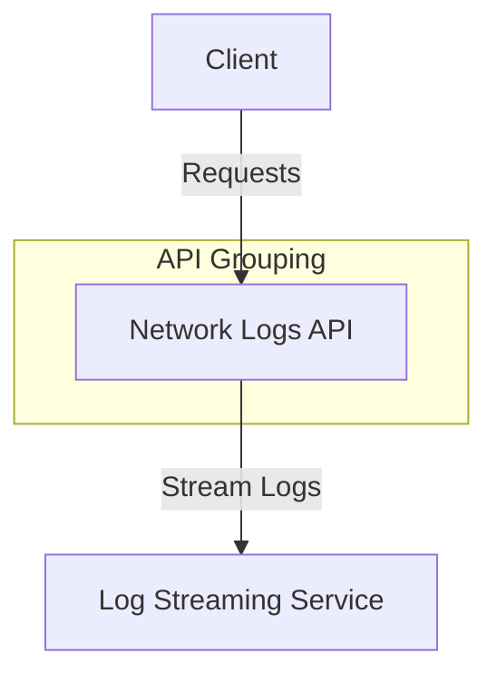

# Network Logs API

## GET /stream-logs/{device_id}
- **Description:** Stream logs for a specific device.
- **Parameters:**
  - `device_id` (required) - The ID of the device.
- **Response:**
  - 200: Log stream.
  - 404: Device not found.