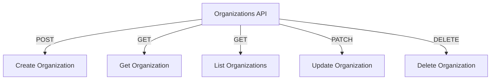

# Organizations API

## Endpoints

- **POST** `/api/organizations`: Create a new organization.
- **GET** `/api/organizations/{org_id}`: Retrieve a specific organization.
- **GET** `/api/organizations`: Retrieve a list of organizations.
- **PATCH** `/api/organizations/{org_id}`: Update a specific organization.
- **DELETE** `/api/organizations/{org_id}`: Delete a specific organization.
