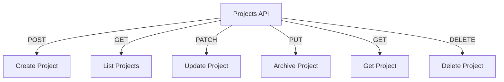

# Projects API

## Endpoints

- **POST** `/api/projects`: Create a new project.
- **GET** `/api/projects`: Retrieve a list of projects.
- **PATCH** `/api/projects/{project_id}`: Update a specific project.
- **PUT** `/api/projects/{project_id}/archive`: Archive a specific project.
- **GET** `/api/projects/{project_id}`: Retrieve a specific project.
- **DELETE** `/api/projects/{project_id}`: Delete a specific project.
