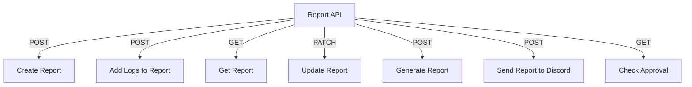

# Report API

## Endpoints

- **POST** `/api/report`: Create a new report.
- **POST** `/api/report/{report_id}/logs`: Add logs to a report.
- **GET** `/api/report/{report_id}`: Retrieve a specific report.
- **PATCH** `/api/report/{report_id}`: Update a specific report.
- **POST** `/api/report/generate-report/{report_id}`: Generate a report.
- **POST** `/api/report/send-discord/{report_id}`: Send a report to Discord.
- **GET** `/api/report/check-approval/{channel_id}/{message_id}`: Check approval status.
