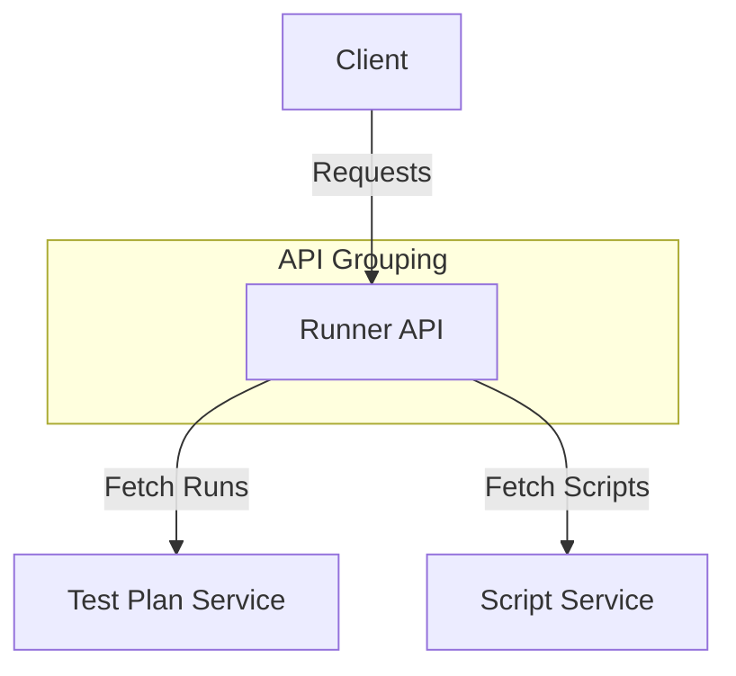

# Runner APIs

## GET /test-plan/{plan_id}/runs
- **Description:** Fetch a list of runs for a specific test plan.
- **Parameters:**
  - `plan_id` (required) - The ID of the test plan.
- **Response:**
  - 200: List of runs.
  - 404: Test plan not found.

## GET /test-plan/{run_code}/scripts
- **Description:** Fetch scripts for a specific run code.
- **Parameters:**
  - `run_code` (required) - The code of the run.
- **Response:**
  - 200: List of scripts.
  - 404: Run code not found.

## POST /test-plan/
- **Description:** Create a new test plan.
- **Request Body:**
  ```json
  {
    "name": "string",
    "description": "string"
  }
  ```
- **Response:**
  - 201: Test plan created successfully.
  - 400: Validation error.