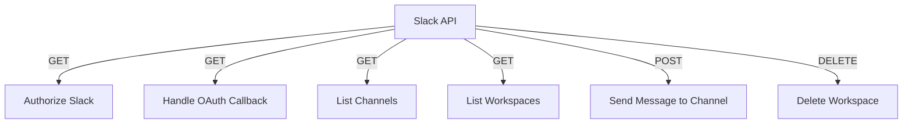

# Slack API

## Endpoints

- **GET** `/api/slack/authorize`: Authorize Slack.
- **GET** `/api/slack/oauth/callback`: Handle Slack OAuth callback.
- **GET** `/api/slack/channels`: Retrieve Slack channels.
- **GET** `/api/slack/workspaces`: Retrieve Slack workspaces.
- **POST** `/api/slack/channels/{channel_id}/messages`: Send messages to a Slack channel.
- **DELETE** `/api/slack/workspaces`: Delete a Slack workspace.
