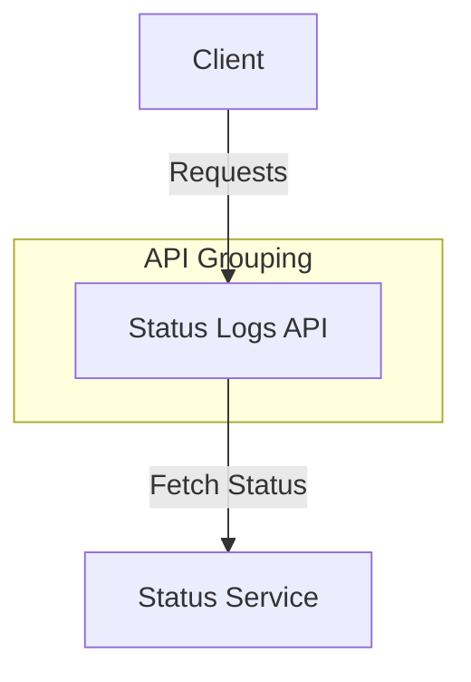

# Status Logs API

## GET /status/{instance_name}/{request_uuid}
- **Description:** Fetch status updates for a specific instance and request.
- **Parameters:**
  - `instance_name` (required) - The name of the instance.
  - `request_uuid` (required) - The UUID of the request.
- **Response:**
  - 200: Status updates.
  - 404: Instance or request not found.