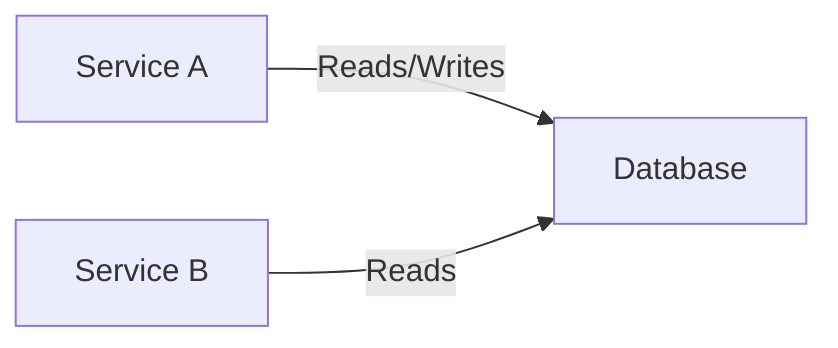
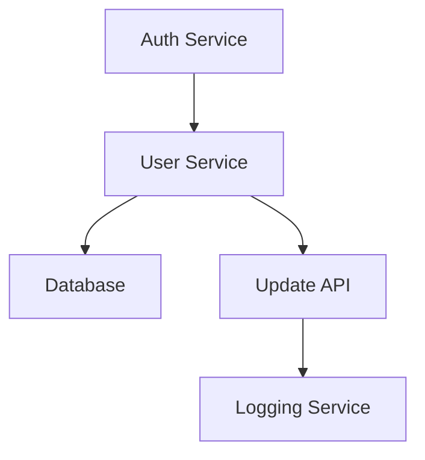
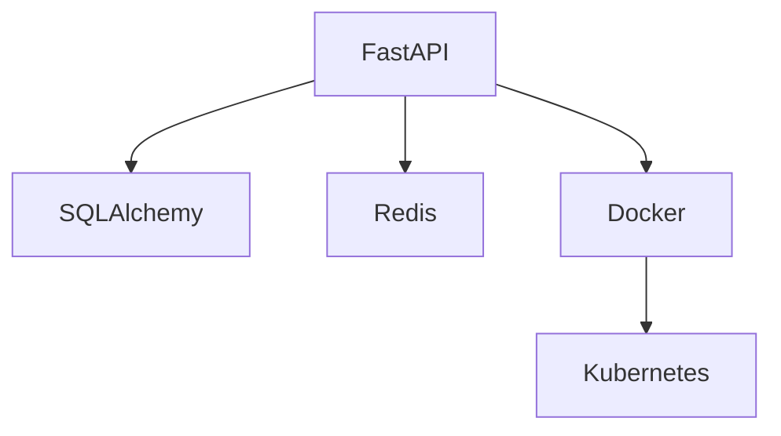
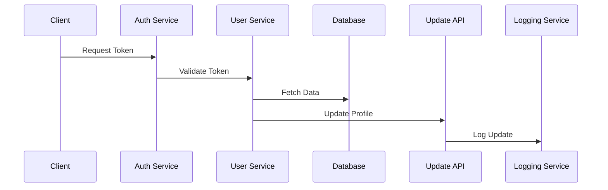

# System Documentation

## 1. System Architecture Overview

### System Flow Diagram
```mermaid
graph TD
    %% Main System Flow
    subgraph Client["Client Layer"]
        [Client components]
    end
    
    subgraph Services["Service Layer"]
        A[Auth Service] -->|Valid Token| B[User Service]
        A -->|Invalid Token| C[Error Response]
        B -->|Fetch Data| D[Database]
        B -->|Update Profile| E[Update API]
        E -->|Logs Update| F[Logging Service]
    end
    
    subgraph Data["Data Layer"]
        D
    end
    
    %% Define relationships
    [System interactions]
```

## 2. Database Infrastructure

### Database Overview
- Database Types: MongoDB, PostgreSQL
- Primary Usage: Data storage and retrieval for various services
- Configurations: Managed separately, configurations are retrieved from environment variables

### Database Relationships


### Configuration Examples
```python
# Example configuration for database URL
database_url: str = Field(default=..., description="Database connection URL")
```

## 3. Architecture Details

### Design Patterns
- Microservices Architecture: Services communicate via REST APIs.

### Service Architecture


### Deployment Strategy
- Services are containerized and deployed using Docker and Kubernetes.

## 4. Tools & Frameworks

### Core Technologies
- Backend: FastAPI, SQLAlchemy
- Frontend: Not specified in the current search
- Database: MongoDB, PostgreSQL
- DevOps: Docker, Kubernetes

### Framework Integration


## 5. API Structure

### Endpoints
- `/api/v1/organizations`
- `/api/v1/projects`
- `/api/v1/folders`
- `/api/v1/test-files`
- `/api/v1/apks`
- `/api/v1/apk-versions`
- `/api/v1/github`
- `/api/v1/apis`

### API Flow


## STYLING GUIDELINES

1. Mermaid Diagram Styles:
```
classDef client fill:#e1f5fe,stroke:#01579b
classDef service fill:#f3e5f5,stroke:#4a148c
classDef database fill:#fff3e0,stroke:#e65100
```

2. Markdown Formatting:
- Use H1 (#) for document title
- Use H2 (##) for main sections
- Use H3 (###) for subsections
- Use code blocks for configurations
- Use bullet points for lists
