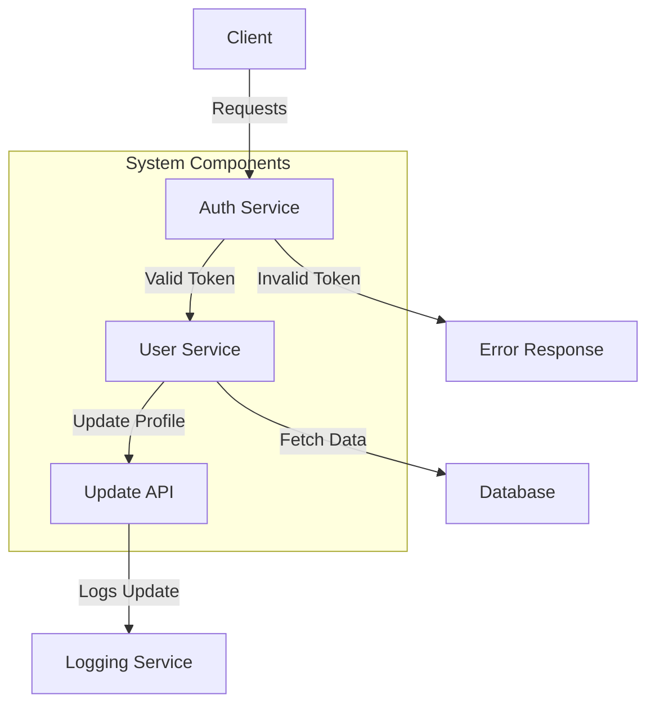

# System Documentation

## 1. System Flow Diagram

This is the example of the flow diagram. make sure to generate the flow diagram for the implementation workflow.
it should contain the detail of the 
**Databases**: Type, configuration, usage, and relevant files. 
**Architecture**: Structure, patterns, and deployment strategies.
**Tools & Frameworks**: Development tools and their purpose.
This is just example of the flow diagram. make sure to generate the flow diagram that is similar to the below diagram . not exact like this.


## 1. Databases Used

### MongoDB
- NoSQL database for flexible data storage.
- Used for storing user and session data.
- Configuration: `config/database.js`
    ```js
    module.exports = {
      mongoURI: "mongodb://localhost:27017/mydb"
    }
    ```

## 2. Architecture Overview

### Microservices Architecture
- Services communicate via REST APIs.
- Database layer managed separately.
- Authentication handled centrally.

## 3. Tools & Frameworks

- **Backend**: Node.js, Express  
- **Frontend**: React.js  
- **Database**: MongoDB, PostgreSQL  
- **Authentication**: JWT, OAuth  
- **DevOps**: Docker, Kubernetes  

---
### **Execution Flow:**  
1. **Extract** details of APIs, databases, tools, and architecture.  
2. **Check for existing file (`system_documentation.md`)**.  
3. **Update if the file exists**, otherwise **create it and store all relevant data**.  
4. **Generate Mermaid.js diagrams** to visualize relationships.  
