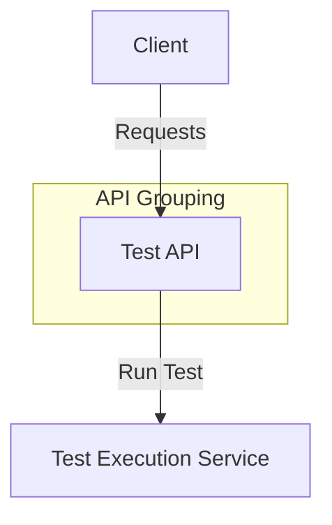

# Test API

## POST /test/
- **Description:** Run a test.
- **Request Body:**
  ```json
  {
    "test_name": "string",
    "parameters": "object"
  }
  ```
- **Response:**
  - 201: Test run successfully.
  - 400: Validation error.