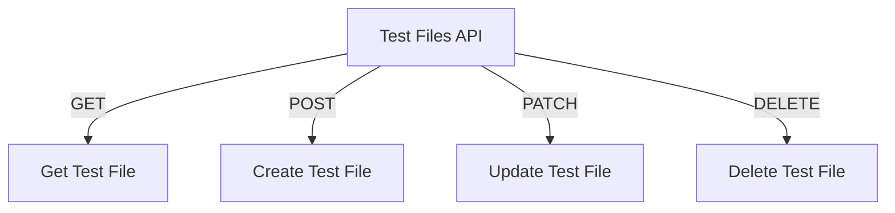

# Test Files API

## Endpoints

- **GET** `/api/test-files/folder/{folder_id}`: Retrieve test files in a folder.
- **GET** `/api/test-files/{test_file_id}`: Retrieve a specific test file.
- **POST** `/api/test-files`: Create a new test file.
- **PATCH** `/api/test-files/{test_file_id}`: Update a specific test file.
- **DELETE** `/api/test-files/{test_file_id}`: Delete a specific test file.
