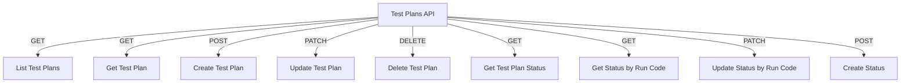

# Test Plans API

## Endpoints

- **GET** `/api/testplans/org`: Retrieve test plans for an organization.
- **GET** `/api/testplans/{test_plan_id}`: Retrieve a specific test plan.
- **POST** `/api/testplans`: Create a new test plan.
- **PATCH** `/api/testplans/{test_plan_id}`: Update a specific test plan.
- **DELETE** `/api/testplans/{test_plan_id}`: Delete a specific test plan.
- **GET** `/api/testplans/test-plan/{test_plan_id}/status`: Retrieve status of a test plan.
- **GET** `/api/testplans/status/{run_code}`: Retrieve status by run code.
- **PATCH** `/api/testplans/status/{run_code}`: Update status by run code.
- **POST** `/api/testplans/status`: Create a new status.
